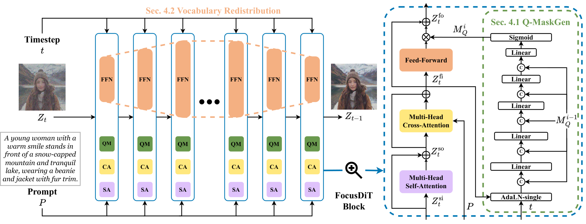

<div align="center">

# FocusDiT: Masking Queries in Diffusion Transformers for Fine-grained Image Generation

Xueji Fang<sup>1,2</sup>, Liyuan Ma<sup>2,*</sup>, Jianhao Zeng<sup>2</sup>,
Jinjin Cao<sup>1,2</sup>, Mingyuan Zhou<sup>2</sup>, Guo-Jun Qi<sup>2,*</sup>

<sup>1</sup> Zhejiang University &nbsp; <sup>2</sup> Westlake University

<sup>*</sup> Corresponding authors

[Paper](https://arxiv.org/abs/2606.02090) · [Model weights](https://www.modelscope.cn/models/HakimZJU/FocusDiT)

[Overview](#overview) · [Getting Started](#getting-started) · [Inference](#inference) · [Implementation status](#implementation-status)

</div>

## Overview

FocusDiT generates detailed images from text prompts by focusing feed-forward network (FFN) updates on image tokens that need finer detail. Its FFN hidden units serve as a vocabulary of visual concepts.

<p align="center">
  
</p>

<p align="center"><em>Images generated by FocusDiT.</em></p>

- **Query Token Masking.** Q-MaskGen predicts a soft mask from image features, the diffusion timestep, and the previous block's mask. It scales each token's FFN update to prioritize detailed regions.
- **Vocabulary Redistribution.** The released configuration assigns different FFN widths to individual blocks according to their visual vocabulary needs.

This repository provides the public model implementation, a Mochi VAE wrapper, a text-to-image inference pipeline, and an example script that can save query-mask visualizations. See [Implementation status](#implementation-status) for the scope of this release.

<p align="center">
  
</p>

<p align="center"><em>FocusDiT architecture and Q-MaskGen.</em></p>

## Getting Started

### Installation

Create a Python 3.10 environment:

```bash
git clone https://github.com/XuejiFang/FocusDiT.git
cd FocusDiT
python3.10 -m venv .venv
source .venv/bin/activate
```

Install a CUDA-enabled PyTorch 2.x build and matching torchvision using the [official PyTorch instructions](https://pytorch.org/get-started/locally/). Then install the remaining packages:

```bash
python -m pip install -r requirements.txt
```

The example loads the transformer and T5 encoder in bfloat16 and the VAE in float32. Use a CUDA GPU with bfloat16 support and enough memory for these models. CPU options for the text encoder and VAE are described under [Inference](#inference).

### Model weights

Download the following three components to local directories. Keep each model's configuration and weight files together; `--vae-path` must point to the **`vae` subdirectory**, not to its parent repository.

One way to download the required files is:

```bash
python -m pip install modelscope huggingface_hub
modelscope download --model HakimZJU/FocusDiT --local_dir checkpoints/FocusDiT
hf download genmo/mochi-1-preview --include "vae/*" --local-dir checkpoints/mochi-1-preview
modelscope download --model google/flan-t5-xxl \
  --include "model-00001-of-00005.safetensors" "model-00002-of-00005.safetensors" "*.json" "spiece.model" \
  --local_dir checkpoints/flan-t5-xxl
python scripts/prepare_t5_encoder.py checkpoints/flan-t5-xxl
```

The pipeline uses `T5EncoderModel`, so only the two FLAN-T5-XXL shards containing its encoder and shared weights are needed. The preparation script requires both downloaded shards, saves the original index as `model.safetensors.full.index.json`, and writes an encoder-only index that Transformers can load. This avoids downloading the unused decoder shards and duplicate PyTorch, TensorFlow, and Flax formats. These downloads are still large and may take time.

| Argument | Source | Expected local directory |
| --- | --- | --- |
| `--transformer-path` | [HakimZJU/FocusDiT on ModelScope](https://www.modelscope.cn/models/HakimZJU/FocusDiT) | Directory containing the FocusDiT Diffusers `config.json` and weights |
| `--vae-path` | [genmo/mochi-1-preview/vae on Hugging Face](https://huggingface.co/genmo/mochi-1-preview/tree/main/vae) | Directory containing the Mochi VAE `config.json` and weights |
| `--text-encoder-path` | [google/flan-t5-xxl on Hugging Face](https://huggingface.co/google/flan-t5-xxl) ([ModelScope mirror](https://modelscope.cn/models/google/flan-t5-xxl)) | Directory containing the T5 configuration, encoder weight shards, prepared index, and tokenizer files |

For example, place them under `checkpoints/FocusDiT`, `checkpoints/mochi-1-preview/vae`, and `checkpoints/flan-t5-xxl`. The model files are hosted by their respective providers and are not included in this Git repository.

## Inference

```bash
python infer.py \
  --transformer-path checkpoints/FocusDiT \
  --vae-path checkpoints/mochi-1-preview/vae \
  --text-encoder-path checkpoints/flan-t5-xxl \
  --prompt "A red fox standing in a snowy forest, detailed fur" \
  --save-mask
```

The script writes `samples/image.png` and, when `--save-mask` is enabled and the checkpoint emits query masks, `samples/query_mask.png`. Use `python infer.py --help` for options including `--negative-prompt`, `--output-dir`, `--seed`, `--height`, `--width`, `--steps`, and `--guidance-scale`. The defaults are 512 × 512 pixels, 30 denoising steps, guidance scale 5.5, and seed 20241120. This example is for **single-image** generation (`num_frames=1`). If GPU memory is limited, add `--text-encoder-device cpu --vae-device cpu` to run T5 encoding and VAE decoding on the CPU. These stages will be slower.

The inference script uses a FlowMatch Euler scheduler with shift 3.0 and classifier-free guidance. Generated images can change with the checkpoint, dependency versions, GPU, seed, and generation settings.

## Implementation status

Q-MaskGen takes the current features after cross-attention, the previous block's mask, and the diffusion timestep. The soft mask is applied to the FFN update before the residual addition:

```text
next_hidden_states = hidden_states + query_mask * FFN(normalized_hidden_states)
```

The implementation is in [`models/focusdit/modules.py`](models/focusdit/modules.py) (`MaskGen` and `BasicTransformerBlock`). [`models/focusdit/modeling_focusdit.py`](models/focusdit/modeling_focusdit.py) assembles the blocks and returns masks for visualization; [`pipelines/pipeline.py`](pipelines/pipeline.py) handles prompt encoding, denoising, and VAE decoding.

Our method also describes cross-block shared FFN experts. The released model code assigns different FFN hidden widths to individual blocks and does not implement cross-block sharing. Q-Mask can also support optional mask-based inference acceleration; the example script does not implement that option.

## Training and evaluation

Training scripts and dataset preparation code are not included in this release. We describe our training setup in Section 5 of the [FocusDiT paper](https://arxiv.org/abs/2606.02090).

## Acknowledgements

The inference implementation builds on [Diffusers](https://github.com/huggingface/diffusers) and uses the [Mochi VAE](https://huggingface.co/genmo/mochi-1-preview) and [FLAN-T5-XXL](https://huggingface.co/google/flan-t5-xxl). Some pipeline code retains its original PixArt-Sigma and Hugging Face copyright notice.

## License

The code in this repository is released under the [Apache License 2.0](LICENSE). Model weights and external components are hosted by their respective providers; check their licenses separately.

## Citation

```bibtex
@misc{fang2026focusdit,
  title={FocusDiT: Masking Queries in Diffusion Transformers for Fine-grained Image Generation},
  author={Xueji Fang and Liyuan Ma and Jianhao Zeng and Jinjin Cao and Mingyuan Zhou and Guo-Jun Qi},
  year={2026},
  eprint={2606.02090},
  archivePrefix={arXiv},
  primaryClass={cs.CV},
  url={https://arxiv.org/abs/2606.02090}
}
```
